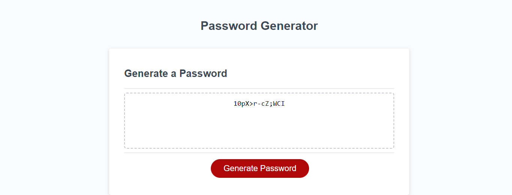

# Random-Password-Generator (1.0)

## Description

This is the initial version of my Random Password Generator submitted by "AD" for Penn Full Stack Web Development. The initial password generator is meant to genrate a user password from uppercase, lowercase, special, and numerical characters randomized. This could be used to professionally create a new secure password.
## Installation

N/A

## Usage

To navigate the Random Password Generator, the user can click on generate password button, select uppercase, lowercase, special character, and numerical conditions and generate their password.

.png

## Credits
https://www.w3schools.com/js/js_conventions.asp
w3 schools misc
## License

MIT License